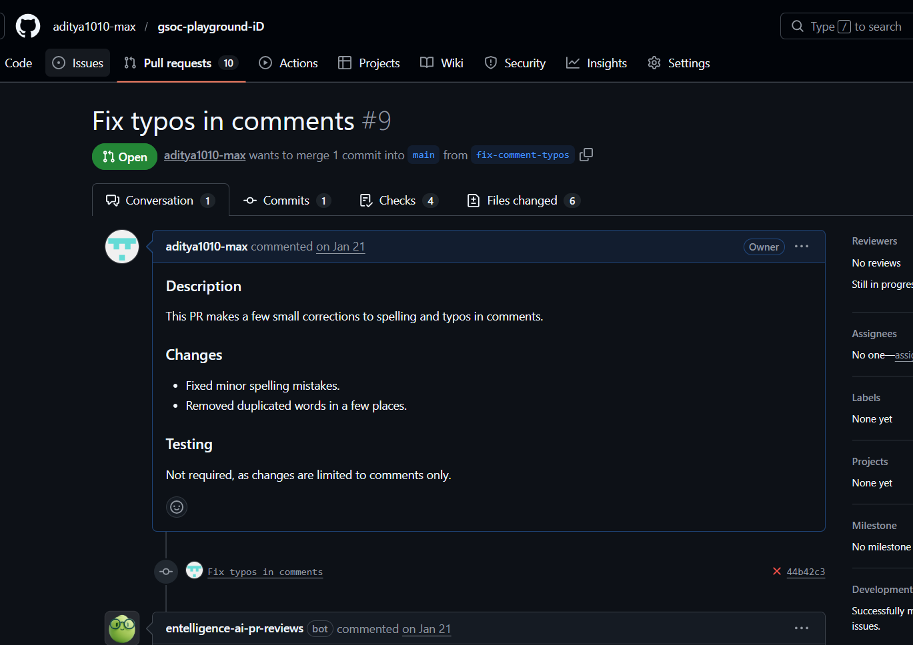

# i dont conside it 

- i definately dont consider it as my first PR 😅

link - [link](https://github.com/aditya1010-max/gsoc-playgrou/pull/9)

- Turns out, I created a pull request in my own fork and spent a good amount of time being nervous about maintainers reviewing it.

- It was honestly one of the most nerve-wracking experiences in my coding journey so far, even though nothing was actually at stake.

## things i learnt

- before this pr , i barely only knew basic commands of git like git add . , or git commit -m "", git push , the basics that all use to push the code

- Through this “mistake PR”, I learned a lot more than I expected- What branches actually are and why they matter, how to restore files from previous commits, why it’s important to create a clean branch instead of committing directly to main, how the pull request workflow really works (fork → branch → upstream), and a lot more

## things i can improve 

- a lot, thank god this pr was in my own fork

- i didnt even lint checked or ran test before creating it(Even though the change was small (fixing typos and removing duplicate words), it showed me how important these habits are.)

- And honestly?
I am glad this happened early.

